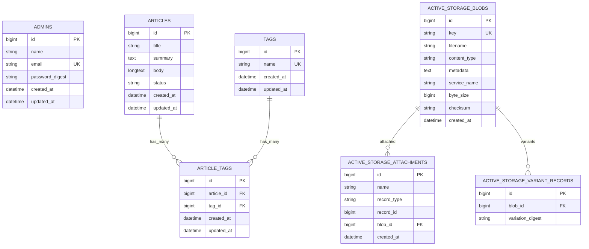

# データベース設計

## 前提

- 正本は `docs/requirements.md` とする。
- 使用DBは MySQL とする。
- 使用言語はRuby、フレームワークはRuby on Railsとする。
- React、Vue、Next.js等の別Frontend frameworkは導入しない。
- Pythonは記事内の学習サンプルとして表示するだけで、Webアプリ本体では実行しない。
- 記事本文はMarkdown原文を `articles.body` に保存する。
- Markdownから変換したHTMLは正本としてDB保存しない。
- Markdown変換後HTMLは必ずsanitizeして表示する。
- Action Text、Trix editor、`action_text_rich_texts`、`has_rich_text :body` は採用しない。
- 一般画面に投稿日は表示しない。ただし `created_at` と `updated_at` は内部管理用としてDBに保存する。
- 管理者ログインIDはメールアドレスとする。管理者IDログイン、管理者登録画面は実装しない。
- 管理者パスワードは平文保存せず、`has_secure_password` 用の `password_digest` にハッシュ化して保存する。

## 推奨するtable構成

MVPで推奨するtableは以下とする。

- `admins`
- `articles`
- `tags`
- `article_tags`
- `active_storage_blobs`
- `active_storage_attachments`
- `active_storage_variant_records`

削除する設計:

- `action_text_rich_texts`
- `has_rich_text :body`
- Action Text関連
- Trix関連

## Markdown library候補

| 候補 | 特徴 | メリット | 注意点 |
| --- | --- | --- | --- |
| CommonMarker | CommonMark/GFM系に強い | GitHub Flavored Markdown相当を狙いやすい | Gem追加とオプション確認が必要 |
| Redcarpet | Railsで利用例が多い | 表、fenced code blockなどを扱いやすい | メンテナンス状況とsanitize併用を確認する |
| Kramdown | Ruby製で扱いやすい | 導入しやすくドキュメントが多い | GFM相当の細部は確認が必要 |

設計上の推奨:

- 80時間MVPでは `commonmarker` を採用する。CommonMark/GFM系に強く、Ruby 3.4.10 / Rails 8.1.3 のWSL環境で `commonmarker 2.9.0 (x86_64-linux)` を導入できることを確認済み。
- Markdown原文からHTMLへ変換し、変換後HTMLは必ずRails標準sanitizerでallowlist sanitizeする。
- CommonMarkerのsyntax highlighter pluginは無効化し、code blockは `code.language-*` classのみ保持する。
- syntax highlightingは候補であり、必須機能にしない。

## tags / article_tags方式とカンマ区切り文字列方式の比較

| 観点 | tags + article_tags | articlesにカンマ区切り文字列 |
| --- | --- | --- |
| 課題要件 | 複数タグ表示に対応しやすい | 表示だけなら対応可能 |
| 4週間80時間 | Modelと関連の実装が増える | 実装は最小 |
| Rails標準との整合 | `has_many :through` で自然 | 文字列加工が中心になる |
| 入力のしやすさ | UIはカンマ区切りのまま実装可能 | UIと保存形式が一致する |
| 表示のしやすさ | 正規化されたタグを表示しやすい | split処理が必要 |
| 将来のタグ検索 | 対応しやすい | LIKE検索になり曖昧 |
| Validation | タグ名の一意性、長さを設定しやすい | 個別タグの検証が難しい |
| 重複タグ | unique制約で防止しやすい | 正規化処理を自作する必要がある |
| DB正規化 | 正規化される | 非正規化 |
| 実装・テスト工数 | 中程度 | 低い |

推奨:

- 入力UIはカンマ区切りにし、DBは `tags` と `article_tags` に正規化する。
- タグ管理画面、タグ別一覧、タグ検索はMVP対象外とする。

## 本文画像方式の比較

| 案 | 内容 | Rails標準との整合 | Active Storage連携 | 実装時間 | 編集しやすさ | Security | 削除時の整合性 |
| --- | --- | --- | --- | --- | --- | --- | --- |
| 案A | 画像upload後、Markdown画像記法を自動生成し本文へ挿入 | よい | よい | 中 | よい | 挿入処理の検証が必要 | 参照切れ確認が必要 |
| 案B | 画像upload後、生成されたMarkdown記法をcopyして本文へ貼り付け | よい | よい | 低 | 中 | 自動DOM操作が少なく安全 | 参照切れ確認が必要 |
| 案C | 記事に複数画像を添付し、専用shortcodeで参照 | 中 | よい | 高 | 中 | shortcode parserの検証が必要 | 記事と画像の対応は管理しやすい |

推奨:

- **案B: 画像upload後、生成されたMarkdown記法をcopyして本文へ貼り付け** を80時間MVPの推奨とする。
- 理由は、Rails標準のActive Storageと連携しやすく、実装時間が短く、自動挿入JavaScriptを最小化できるため。
- 時間に余裕があれば案Aの自動挿入を検討する。
- 案Cはshortcode設計とparserが増えるためMVPでは採用しない。

## Preview方式の比較

| 案 | 内容 | メリット | デメリット | MVP判断 |
| --- | --- | --- | --- | --- |
| 案A | 入力中のreal-time preview | 使いやすい | JavaScriptと同期処理が増える | 簡略化可能 |
| 案B | Preview buttonでサーバーへ送信し表示 | Rails側のMarkdown変換・sanitizeを共通利用できる | 入力中に即時更新されない | 推奨 |
| 案C | 同一画面内でJavaScriptによりpreview | 画面遷移なしで軽快 | Ruby側変換処理との二重実装になりやすい | 非推奨 |

推奨:

- **案B: Preview buttonでサーバーへ送信し表示** を推奨する。
- Ruby中心・80時間MVPを優先し、Markdown変換とsanitizeの正本処理をRails側に置く。
- real-time previewは時間不足時に実装しない。

## tables

## admins

| 項目 | 内容 |
| --- | --- |
| table名 | `admins` |
| 目的 | 管理者ログイン情報を保持する |
| 主な関連 | MVPでは記事との直接関連は必須にしない |
| 削除時の挙動 | 初期管理者は削除画面を作らない |

| column名 | 型 | NULL可否 | default | index | unique制約 | 外部キー |
| --- | --- | --- | --- | --- | --- | --- |
| `id` | bigint | 不可 | auto increment | primary key | unique | なし |
| `name` | string | 不可 | なし | なし | なし | なし |
| `email` | string | 不可 | なし | あり | あり | なし |
| `password_digest` | string | 不可 | なし | なし | なし | なし |
| `created_at` | datetime | 不可 | Rails標準 | なし | なし | なし |
| `updated_at` | datetime | 不可 | Rails標準 | なし | なし | なし |

Validation案:

- `name`: presence、最大50文字程度
- `email`: presence、format、uniqueness、最大255文字程度
- `password`: presence、最小8文字程度。作成時のみ必須
- `password_digest`: `has_secure_password` により利用

補足:

- 初期管理者は `db/seeds.rb` で作成する。
- DB上は複数管理者を許容できるが、権限分けは対象外とする。

## articles

| 項目 | 内容 |
| --- | --- |
| table名 | `articles` |
| 目的 | 記事の基本情報、Markdown本文、一覧表示情報、公開状態を保持する |
| 主な関連 | `has_many :article_tags`, `has_many :tags, through: :article_tags`, `has_one_attached :thumbnail` |
| 削除時の挙動 | MVPでは物理削除。関連する `article_tags` は削除。Active Storage添付のpurge方針は実装時に確認する |

| column名 | 型 | NULL可否 | default | index | unique制約 | 外部キー |
| --- | --- | --- | --- | --- | --- | --- |
| `id` | bigint | 不可 | auto increment | primary key | unique | なし |
| `title` | string | 不可 | なし | あり | なし | なし |
| `summary` | text | 不可 | なし | なし | なし | なし |
| `body` | longtext | 不可 | なし | なし | なし | なし |
| `status` | string | 不可 | `draft` | あり | なし | なし |
| `created_at` | datetime | 不可 | Rails標準 | なし | なし | なし |
| `updated_at` | datetime | 不可 | Rails標準 | なし | なし | なし |

`body` の型:

- MySQLでは `LONGTEXT` を推奨する。
- 400文字以上の日本語本文、表、code sample、実行結果例、Markdown画像記法を十分保存できるようにする。
- `TEXT` でもMVPの最低要件は満たせるが、学習記事のコード例や表が増えるため `LONGTEXT` の方が余裕がある。

Validation案:

- `title`: presence、最大100文字程度
- `summary`: presence、最大200文字程度
- `body`: presence、Markdown記号やHTMLではなく表示上のplain text相当で400文字以上
- fenced code block内のコード本文は文字数に含める
- linkは表示文字列のみ文字数に含め、URL自体は原則含めない
- 画像はalt textを文字数に含める
- whitespaceを正規化して判定する
- 課題適合のため、実運用では説明文だけでも400文字以上を目標とする
- `status`: inclusion in `draft`, `published`
- `thumbnail`: content type JPEG/PNG/WebP、容量5MB以下

補足:

- Markdown原文を正本とする。
- HTMLへ変換した結果を正本として保存しない。
- 一般画面では `published` のみ表示する。
- `created_at` は保存するが、一般画面には表示しない。

## tags

| 項目 | 内容 |
| --- | --- |
| table名 | `tags` |
| 目的 | タグ名を正規化して保持する |
| 主な関連 | `has_many :article_tags`, `has_many :articles, through: :article_tags` |
| 削除時の挙動 | MVPではタグ削除画面を作らない |

| column名 | 型 | NULL可否 | default | index | unique制約 | 外部キー |
| --- | --- | --- | --- | --- | --- | --- |
| `id` | bigint | 不可 | auto increment | primary key | unique | なし |
| `name` | string | 不可 | なし | あり | あり | なし |
| `created_at` | datetime | 不可 | Rails標準 | なし | なし | なし |
| `updated_at` | datetime | 不可 | Rails標準 | なし | なし | なし |

Validation案:

- `name`: presence、uniqueness、最大30文字程度
- 入力時に前後空白を除去する
- 空タグは保存しない

## article_tags

| 項目 | 内容 |
| --- | --- |
| table名 | `article_tags` |
| 目的 | 記事とタグの多対多関連を保持する |
| 主な関連 | `belongs_to :article`, `belongs_to :tag` |
| 削除時の挙動 | 記事削除時に関連行を削除する |

| column名 | 型 | NULL可否 | default | index | unique制約 | 外部キー |
| --- | --- | --- | --- | --- | --- | --- |
| `id` | bigint | 不可 | auto increment | primary key | unique | なし |
| `article_id` | bigint | 不可 | なし | あり | 複合unique | `articles.id` |
| `tag_id` | bigint | 不可 | なし | あり | 複合unique | `tags.id` |
| `created_at` | datetime | 不可 | Rails標準 | なし | なし | なし |
| `updated_at` | datetime | 不可 | Rails標準 | なし | なし | なし |

Index案:

- `index_article_tags_on_article_id`
- `index_article_tags_on_tag_id`
- `unique index_article_tags_on_article_id_and_tag_id`

Validation案:

- `article_id`: presence
- `tag_id`: presence
- `article_id` と `tag_id` の組み合わせは一意

## Active Storage関連table

Active Storageは維持する。用途は以下とする。

- 記事一覧用thumbnail: `Article has_one_attached :thumbnail`
- 記事本文用画像: upload補助でActive Storageへ保存し、生成したMarkdown画像記法から参照する

## active_storage_blobs

| 項目 | 内容 |
| --- | --- |
| table名 | `active_storage_blobs` |
| 目的 | アップロードファイルのメタデータを保持する |
| 主な関連 | `active_storage_attachments` から参照される |
| 削除時の挙動 | 添付削除後、不要なblobをpurgeする運用を検討する |

Rails標準の主なcolumn:

| column名 | 型 | NULL可否 | default | index | unique制約 | 外部キー |
| --- | --- | --- | --- | --- | --- | --- |
| `id` | bigint | 不可 | auto increment | primary key | unique | なし |
| `key` | string | 不可 | なし | あり | あり | なし |
| `filename` | string | 不可 | なし | なし | なし | なし |
| `content_type` | string | 可 | なし | なし | なし | なし |
| `metadata` | text | 可 | なし | なし | なし | なし |
| `service_name` | string | 不可 | なし | なし | なし | なし |
| `byte_size` | bigint | 不可 | なし | なし | なし | なし |
| `checksum` | string | 可 | なし | なし | なし | なし |
| `created_at` | datetime | 不可 | Rails標準 | なし | なし | なし |

## active_storage_attachments

| 項目 | 内容 |
| --- | --- |
| table名 | `active_storage_attachments` |
| 目的 | ファイルと添付先レコードの関連を保持する |
| 主な関連 | `Article has_one_attached :thumbnail`、本文画像upload補助 |
| 削除時の挙動 | 記事削除時に添付関連が削除される想定。blob本体の削除はpurgeの扱いを確認する |

Rails標準の主なcolumn:

| column名 | 型 | NULL可否 | default | index | unique制約 | 外部キー |
| --- | --- | --- | --- | --- | --- | --- |
| `id` | bigint | 不可 | auto increment | primary key | unique | なし |
| `name` | string | 不可 | なし | 複合index | 複合unique候補 | なし |
| `record_type` | string | 不可 | なし | 複合index | 複合unique候補 | polymorphic |
| `record_id` | bigint | 不可 | なし | 複合index | 複合unique候補 | polymorphic |
| `blob_id` | bigint | 不可 | なし | あり | なし | `active_storage_blobs.id` |
| `created_at` | datetime | 不可 | Rails標準 | なし | なし | なし |

## active_storage_variant_records

| 項目 | 内容 |
| --- | --- |
| table名 | `active_storage_variant_records` |
| 目的 | Active Storage variantの処理結果を記録する |
| 主な関連 | `active_storage_blobs` |
| 削除時の挙動 | Rails標準に従う |

Rails標準の主なcolumn:

| column名 | 型 | NULL可否 | default | index | unique制約 | 外部キー |
| --- | --- | --- | --- | --- | --- | --- |
| `id` | bigint | 不可 | auto increment | primary key | unique | なし |
| `blob_id` | bigint | 不可 | なし | あり | 複合unique候補 | `active_storage_blobs.id` |
| `variation_digest` | string | 不可 | なし | あり | 複合unique候補 | なし |

## ER図

Mermaidが表示されない場合の説明:

- `articles` と `tags` は多対多で、結合table `article_tags` を通して関連する。
- `articles.body` にMarkdown原文を保存する。
- thumbnailと本文画像は Active Storage の `active_storage_blobs` と `active_storage_attachments` により管理する。
- `admins` は管理者ログイン用tableで、MVPでは記事との直接関連は必須にしない。

## Security設計

- Markdown変換後HTMLをそのまま無制限に出力しない。
- sanitizeを行う。
- `script` tagを許可しない。
- event handler属性を許可しない。
- `iframe` は原則許可しない。
- 任意 `style` 属性は原則許可しない。
- 許可するclassを限定する。
- linkの危険なschemeを拒否する。
- image URLまたはActive Storage参照を安全に扱う。MVPでは同一originのroot-relative pathのみ許可し、`data:` URI、外部画像URL、通常の相対pathは許可しない。
- raw HTMLはCommonMarker側でunsafe出力を無効化し、sanitize allowlistでも許可要素を限定する。
- `target="_blank"` を許可する場合は `rel="noopener noreferrer"` を保証する。
- code block内は実行しない。
- Python codeをサーバーで実行しない。

## 文字装飾要件への対応方針

| 要件 | Markdown標準での対応 | MVP方針 |
| --- | --- | --- |
| 見出し | 対応可能 | 採用 |
| 段落 | 対応可能 | 採用 |
| 太字 | 対応可能 | 採用 |
| 箇条書き | 対応可能 | 採用 |
| 番号付きリスト | 対応可能 | 採用 |
| 引用 | 対応可能 | 採用 |
| リンク | 対応可能 | 採用 |
| 表 | GFM相当で対応候補 | 採用候補 |
| inline code | 対応可能 | 採用 |
| fenced code block | 対応可能 | 採用 |
| code language指定 | 対応可能 | 表示classとして扱う |
| 画像 | 対応可能 | Active Storage参照を安全に扱う |
| 水平線 | 対応可能 | 採用 |
| 文字色 | 標準では不足 | 許可した1〜2色の限定class |
| 下線 | 標準では不足 | 限定記法または安全な専用class |
| 画像サイズ | 標準では不足 | 小・中・大の3段階 |

対象外:

- 任意HTMLの無制限許可
- 自由なdrag resize
- 無制限color picker
- 任意style属性
- ブラウザ上でのPython実行
- サーバー上でのPython実行
