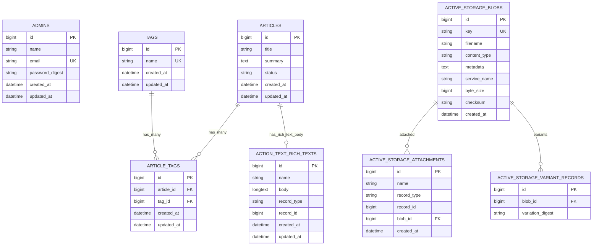

# データベース設計

## 前提

- 正本は `docs/requirements.md` とする。
- 使用DBは MySQL とする。
- Rails標準のMVC、Active Record、RESTful設計に沿う。
- 今回は設計資料のみを作成し、Migration、Model、seed、MySQL作成は行わない。
- 一般画面に投稿日は表示しない。ただし `created_at` と `updated_at` は内部管理用としてDBに保存する。
- 管理者パスワードは平文保存せず、`has_secure_password` 用の `password_digest` にハッシュ化して保存する。
- 管理者ログインIDはメールアドレスとする。管理者IDログイン、管理者登録画面は実装しない。

## 推奨するtable構成

MVPで推奨するtableは以下とする。

- `admins`
- `articles`
- `tags`
- `article_tags`
- `active_storage_blobs`
- `active_storage_attachments`
- `active_storage_variant_records`
- `action_text_rich_texts`

`active_storage_*` と `action_text_rich_texts` は Rails 標準機能を使う場合に生成されるtableであり、独自設計で直接CRUDするtableではない。

## tags / article_tags方式とカンマ区切り文字列方式の比較

| 観点 | tags + article_tags | articlesにカンマ区切り文字列 |
| --- | --- | --- |
| 課題要件 | 複数タグ表示に対応しやすい | 表示だけなら対応可能 |
| 4週間の開発期間 | Modelと関連の実装が増える | 実装は最小 |
| Rails標準との整合 | `has_many :through` で自然 | 文字列加工が中心になる |
| 入力のしやすさ | UIはカンマ区切りのまま実装可能 | UIと保存形式が一致する |
| 表示のしやすさ | 正規化されたタグを表示しやすい | split処理が必要 |
| 将来のタグ検索 | 対応しやすい | LIKE検索になり曖昧 |
| Validation | タグ名の一意性、長さを設定しやすい | 個別タグの検証が難しい |
| 重複タグ | unique制約で防止しやすい | 正規化処理を自作する必要がある |
| DB正規化 | 正規化される | 非正規化 |
| 実装・テスト工数 | 中程度 | 低い |

### 推奨

**`tags` と `article_tags` を独立tableにする方式を推奨する。**

理由:

- 要件に「タグは複数設定できる」「タグはカンマ区切りで入力できる」「記事詳細画面にタグを表示する」とあるため、入力UIはカンマ区切りにしつつ、DBは正規化できる。
- 将来のタグ検索や関連記事表示に拡張しやすい。
- Rails の `has_many :through` と相性がよい。
- 4週間MVPでも、タグ機能は要件に明記されているため、最初から最低限の正規化をしておく価値がある。

ただし、高度なタグ管理画面、タグ別一覧ページ、タグ検索は今回のMVPでは作らない。

## Action Text採用判断

### 推奨

**Action Textを採用する。別エディタは導入しない。**

理由:

- 記事本文への画像挿入、見出し、段落、リンクなどをRails標準寄りに実現できる。
- Active Storageと連携し、本文内画像を扱いやすい。
- 管理者がプログラムを直接変更せず記事本文を編集する要件に合う。

### 注意点

- Action Textを使用する場合、記事本文は `articles.body` の通常の `TEXT` column としては持たない。
- Rails標準構成では `action_text_rich_texts` に本文が保存され、`articles` とは polymorphic association で関連する。
- Modelでは実装時に `has_rich_text :body` を使う想定とする。
- Trix editorの標準機能だけでは、文字色、文字サイズ、下線、画像サイズ調整をすべて細かく実現するのは難しい。
- 4週間MVPでは、見出し、段落、リンク、画像挿入をAction Text標準で対応し、文字色・文字サイズ・下線・画像サイズ調整はTrixへの最小限のCSS・JavaScript拡張で対応する。
- 文字色は固定色、文字サイズは小・標準・大などのプリセット、画像サイズは小・中・大または50%・75%・100%のプリセットとする。
- 自由なドラッグリサイズ、無制限カラーピッカー、別エディタ導入は対象外とする。

## Active Storage採用判断

### 推奨

**Active Storageを採用する。**

理由:

- Rails標準で画像アップロードを扱える。
- Action Text本文内画像で内部的に利用される。
- 一覧用thumbnailも `Article has_one_attached :thumbnail` として扱いやすい。

### 画像の扱い

- 一覧用画像: `articles` に `has_one_attached :thumbnail` を設定する想定。
- 本文内画像: Action Textの本文内添付として扱う想定。
- 画像形式: JPEG、PNG、WebPを推奨候補とする。
- 画像容量: 1ファイルあたり5MB程度を上限候補とする。
- 画像サイズ調整: 表示側CSSで最大幅を制御し、本文内の個別サイズは小・中・大または50%・75%・100%のプリセットで扱う。

## tables

## admins

| 項目 | 内容 |
| --- | --- |
| table名 | `admins` |
| 目的 | 管理者ログイン情報を保持する |
| 主な関連 | 記事作成者を保持する場合は `articles.admin_id` と関連可能。ただしMVPでは必須にしない |
| 削除時の挙動 | 初期管理者は削除画面を作らない |

| column名 | 型 | NULL可否 | default | index | unique制約 | 外部キー |
| --- | --- | --- | --- | --- | --- | --- |
| `id` | bigint | 不可 | auto increment | primary key | unique | なし |
| `name` | string | 不可 | なし | なし | なし | なし |
| `email` | string | 不可 | なし | あり | あり | なし |
| `password_digest` | string | 不可 | なし | なし | なし | なし |
| `created_at` | datetime | 不可 | Rails標準 | なし | なし | なし |
| `updated_at` | datetime | 不可 | Rails標準 | なし | なし | なし |

Validation案:

- `name`: presence、最大50文字程度
- `email`: presence、format、uniqueness、最大255文字程度
- `password`: presence、最小8文字程度。作成時のみ必須
- `password_digest`: `has_secure_password` により利用

補足:

- 要件定義書では「管理者IDまたはメールアドレス」とあるが、確定方針としてメールアドレスをログインIDとする。管理者IDログインは実装しない。
- `name` は管理者の表示名として扱う。
- 初期管理者は `db/seeds.rb` で作成する。
- 複数管理者の権限分けは対象外。ただしDB上は複数行を許容する。

## articles

| 項目 | 内容 |
| --- | --- |
| table名 | `articles` |
| 目的 | 記事の基本情報、一覧表示情報、公開状態を保持する |
| 主な関連 | `has_many :article_tags`, `has_many :tags, through: :article_tags`, `has_rich_text :body`, `has_one_attached :thumbnail` |
| 削除時の挙動 | MVPでは物理削除。関連する `article_tags` は削除。Action TextとActive Storageの関連データ削除挙動を実装時に確認する |

| column名 | 型 | NULL可否 | default | index | unique制約 | 外部キー |
| --- | --- | --- | --- | --- | --- | --- |
| `id` | bigint | 不可 | auto increment | primary key | unique | なし |
| `title` | string | 不可 | なし | あり | なし | なし |
| `summary` | text | 不可 | なし | なし | なし | なし |
| `status` | string | 不可 | `draft` | あり | なし | なし |
| `created_at` | datetime | 不可 | Rails標準 | なし | なし | なし |
| `updated_at` | datetime | 不可 | Rails標準 | なし | なし | なし |

Validation案:

- `title`: presence、最大100文字程度
- `summary`: presence、最大200文字程度
- `body`: presence、本文400文字以上。Action Text本文のHTMLタグを除いたplain textで判定する。
- `status`: inclusion in `draft`, `published`
- `thumbnail`: content type JPEG/PNG/WebP、容量5MB以下

要件にないcolumnを追加する理由:

- `summary`: 記事一覧に記事概要を表示する要件があるため。本文から自動生成も可能だが、初心者向け学習サイトでは一覧用の読みやすい説明を手入力できる価値が高い。
- `status`: 公開前の記事を一般画面に表示しないため。8記事以上・各記事400文字以上の完成条件を満たす前に下書き保存できる。

補足:

- `body` はAction Textを使うため、`articles` tableには通常の `body` columnを作らない。
- `created_at` は保存するが、一般画面には表示しない。
- 管理画面では内部管理として更新日時や公開状態を表示してよい。
- `status` はMVPでは string で `draft` / `published` を扱う案を推奨する。Rails enumにする場合は integer も候補だが、設計の読みやすさを優先する。

## tags

| 項目 | 内容 |
| --- | --- |
| table名 | `tags` |
| 目的 | タグ名を正規化して保持する |
| 主な関連 | `has_many :article_tags`, `has_many :articles, through: :article_tags` |
| 削除時の挙動 | MVPではタグ削除画面を作らない。記事更新時に未使用タグを自動削除するかは実装時判断 |

| column名 | 型 | NULL可否 | default | index | unique制約 | 外部キー |
| --- | --- | --- | --- | --- | --- | --- |
| `id` | bigint | 不可 | auto increment | primary key | unique | なし |
| `name` | string | 不可 | なし | あり | あり | なし |
| `created_at` | datetime | 不可 | Rails標準 | なし | なし | なし |
| `updated_at` | datetime | 不可 | Rails標準 | なし | なし | なし |

Validation案:

- `name`: presence、uniqueness、最大30文字程度
- 入力時に前後空白を除去する。
- 空タグは保存しない。

補足:

- タグ入力UIは要件どおりカンマ区切りの1入力欄とする。
- 例: `Python, 統計, 初心者`
- 実装時は分割、trim、空文字除去、重複除去を行ってから保存する。

## article_tags

| 項目 | 内容 |
| --- | --- |
| table名 | `article_tags` |
| 目的 | 記事とタグの多対多関連を保持する |
| 主な関連 | `belongs_to :article`, `belongs_to :tag` |
| 削除時の挙動 | 記事削除時に関連行を削除する |

| column名 | 型 | NULL可否 | default | index | unique制約 | 外部キー |
| --- | --- | --- | --- | --- | --- | --- |
| `id` | bigint | 不可 | auto increment | primary key | unique | なし |
| `article_id` | bigint | 不可 | なし | あり | 複合unique | `articles.id` |
| `tag_id` | bigint | 不可 | なし | あり | 複合unique | `tags.id` |
| `created_at` | datetime | 不可 | Rails標準 | なし | なし | なし |
| `updated_at` | datetime | 不可 | Rails標準 | なし | なし | なし |

Index案:

- `index_article_tags_on_article_id`
- `index_article_tags_on_tag_id`
- `unique index_article_tags_on_article_id_and_tag_id`

Validation案:

- `article_id`: presence
- `tag_id`: presence
- `article_id` と `tag_id` の組み合わせは一意

## action_text_rich_texts

| 項目 | 内容 |
| --- | --- |
| table名 | `action_text_rich_texts` |
| 目的 | Action Textのリッチ本文を保存する |
| 主な関連 | `Article has_rich_text :body` |
| 削除時の挙動 | 記事削除時に関連するリッチテキストも削除される想定。実装時にRailsバージョンの挙動を確認する |

Rails標準の主なcolumn:

| column名 | 型 | NULL可否 | default | index | unique制約 | 外部キー |
| --- | --- | --- | --- | --- | --- | --- |
| `id` | bigint | 不可 | auto increment | primary key | unique | なし |
| `name` | string | 不可 | なし | 複合index | 複合unique候補 | なし |
| `body` | longtext | 可 | なし | なし | なし | なし |
| `record_type` | string | 不可 | なし | 複合index | 複合unique候補 | polymorphic |
| `record_id` | bigint | 不可 | なし | 複合index | 複合unique候補 | polymorphic |
| `created_at` | datetime | 不可 | Rails標準 | なし | なし | なし |
| `updated_at` | datetime | 不可 | Rails標準 | なし | なし | なし |

補足:

- `record_type = "Article"`、`record_id = articles.id`、`name = "body"` のように関連する。
- 本文中の画像添付はAction TextとActive Storageの連携で扱う。
- 文字色・文字サイズ・下線・画像サイズ調整は、Trixへ最小限のCSS・JavaScript拡張を追加して対応する。

## active_storage_blobs

| 項目 | 内容 |
| --- | --- |
| table名 | `active_storage_blobs` |
| 目的 | アップロードファイルのメタデータを保持する |
| 主な関連 | `active_storage_attachments` から参照される |
| 削除時の挙動 | 添付削除後、不要なblobをpurgeする運用を検討する |

Rails標準の主なcolumn:

| column名 | 型 | NULL可否 | default | index | unique制約 | 外部キー |
| --- | --- | --- | --- | --- | --- | --- |
| `id` | bigint | 不可 | auto increment | primary key | unique | なし |
| `key` | string | 不可 | なし | あり | あり | なし |
| `filename` | string | 不可 | なし | なし | なし | なし |
| `content_type` | string | 可 | なし | なし | なし | なし |
| `metadata` | text | 可 | なし | なし | なし | なし |
| `service_name` | string | 不可 | なし | なし | なし | なし |
| `byte_size` | bigint | 不可 | なし | なし | なし | なし |
| `checksum` | string | 可 | なし | なし | なし | なし |
| `created_at` | datetime | 不可 | Rails標準 | なし | なし | なし |

## active_storage_attachments

| 項目 | 内容 |
| --- | --- |
| table名 | `active_storage_attachments` |
| 目的 | ファイルと添付先レコードの関連を保持する |
| 主な関連 | `Article has_one_attached :thumbnail`、Action Text本文内添付 |
| 削除時の挙動 | 記事削除時に添付関連が削除される想定。blob本体の削除はpurgeの扱いを確認する |

Rails標準の主なcolumn:

| column名 | 型 | NULL可否 | default | index | unique制約 | 外部キー |
| --- | --- | --- | --- | --- | --- | --- |
| `id` | bigint | 不可 | auto increment | primary key | unique | なし |
| `name` | string | 不可 | なし | 複合index | 複合unique候補 | なし |
| `record_type` | string | 不可 | なし | 複合index | 複合unique候補 | polymorphic |
| `record_id` | bigint | 不可 | なし | 複合index | 複合unique候補 | polymorphic |
| `blob_id` | bigint | 不可 | なし | あり | なし | `active_storage_blobs.id` |
| `created_at` | datetime | 不可 | Rails標準 | なし | なし | なし |

補足:

- 一覧用thumbnailは `record_type = "Article"`、`name = "thumbnail"` のように関連する。
- 本文内画像はAction Textの添付として関連する。

## active_storage_variant_records

| 項目 | 内容 |
| --- | --- |
| table名 | `active_storage_variant_records` |
| 目的 | Active Storage variantの処理結果を記録する |
| 主な関連 | `active_storage_blobs` |
| 削除時の挙動 | Rails標準に従う |

Rails標準の主なcolumn:

| column名 | 型 | NULL可否 | default | index | unique制約 | 外部キー |
| --- | --- | --- | --- | --- | --- | --- |
| `id` | bigint | 不可 | auto increment | primary key | unique | なし |
| `blob_id` | bigint | 不可 | なし | あり | 複合unique候補 | `active_storage_blobs.id` |
| `variation_digest` | string | 不可 | なし | あり | 複合unique候補 | なし |

## ER図

Mermaidが表示されない場合の説明:

- `articles` と `tags` は多対多で、結合table `article_tags` を通して関連する。
- `articles` の本文は `action_text_rich_texts` に保存される。
- 一覧用thumbnailと本文内画像は Active Storage の `active_storage_blobs` と `active_storage_attachments` により管理される。
- `admins` は管理者ログイン用tableで、MVPでは記事との直接関連は必須にしない。

## 設計上の検討事項

| 検討事項 | 推奨案 | 理由 |
| --- | --- | --- |
| 管理者は1名固定か複数登録可能か | DB上は複数登録可能、運用は1名 | 権限分けは対象外だが、将来の追加に耐えやすい |
| 管理者の新規登録画面を作るか | 作らない | 4週間MVPでは不要で、セキュリティ検討が増える |
| 初期管理者をseedsで作成するか | 作成する | 管理者ログイン情報提出要件に対応しやすい |
| ログインID | メールアドレス | 一意性を担保しやすい。管理者IDログインは実装しない |
| 記事公開状態 | `draft` / `published` を持つ | 未完成記事を一般画面に出さないため |
| 下書き保存 | `status = draft` で実現 | 専用機能を増やさずMVPに収まる |
| 記事概要 | `summary` を手入力 | 一覧で読みやすい説明を作れる |
| 一覧用画像と本文画像 | 分ける | thumbnailと本文画像で用途が違う |
| タグ入力 | カンマ区切りUI、DBは正規化 | 要件とDB設計の両方に合う |
| 記事削除 | 物理削除 | 論理削除はMVPでは過剰 |
| 画像制限 | JPEG/PNG/WebP、5MB程度 | 不正ファイルと過大ファイルを防ぐ |
| 404ページ | Week 4で実装 | 設計には含め、仕上げで対応する |

## 文字装飾要件への対応方針

| 要件 | Action Text標準での対応 | MVP方針 |
| --- | --- | --- |
| 見出し | 対応可能 | 採用 |
| 段落 | 対応可能 | 採用 |
| リンク | 対応可能 | 採用 |
| 画像挿入 | Active Storage連携で対応可能 | 採用 |
| 文字色 | 標準では弱い | 固定色プリセットをTrixへ最小拡張 |
| 文字サイズ | 標準では弱い | 小・標準・大などのプリセットをTrixへ最小拡張 |
| 下線 | 標準では弱い | 下線ボタンをTrixへ最小拡張 |
| 画像サイズ調整 | 個別調整は標準では弱い | 小・中・大または50%・75%・100%のプリセットをTrixへ最小拡張 |

対象外:

- 別エディタ導入
- 自由なドラッグリサイズ
- 無制限カラーピッカー
- 任意の文字サイズ入力
