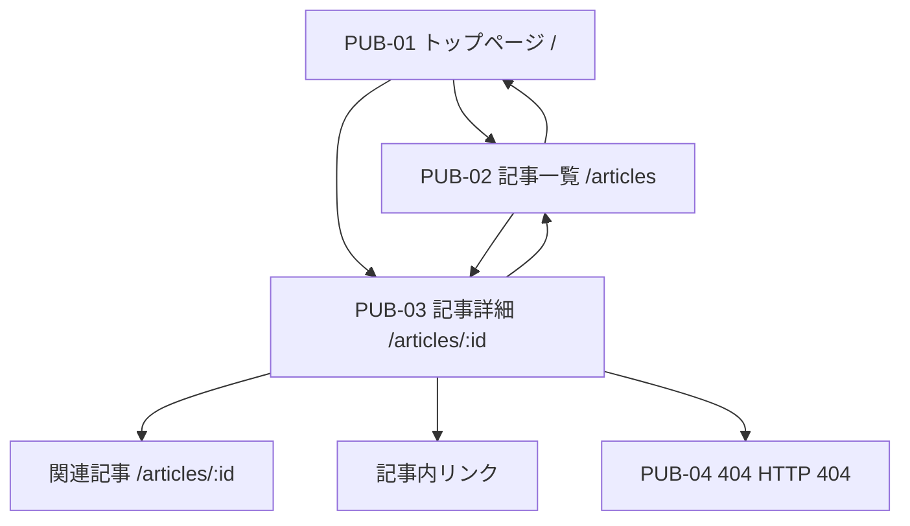
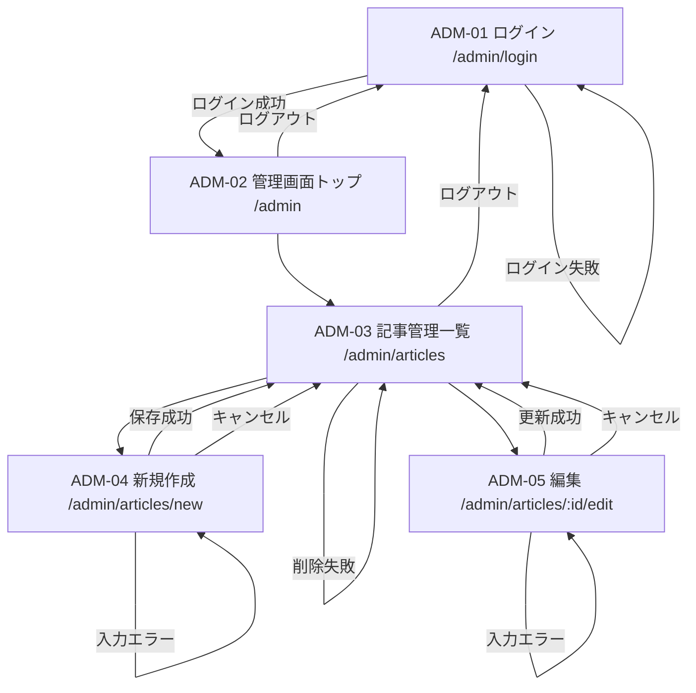
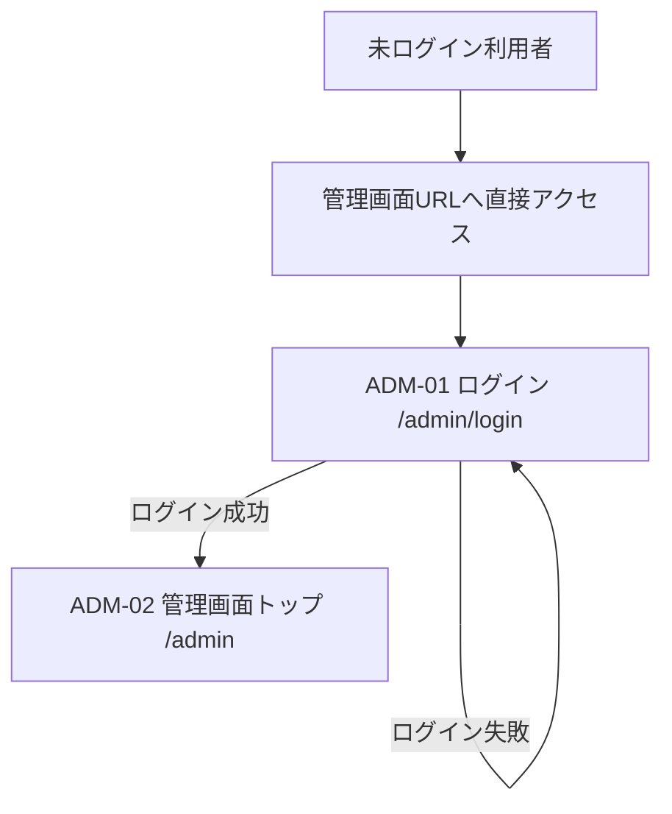
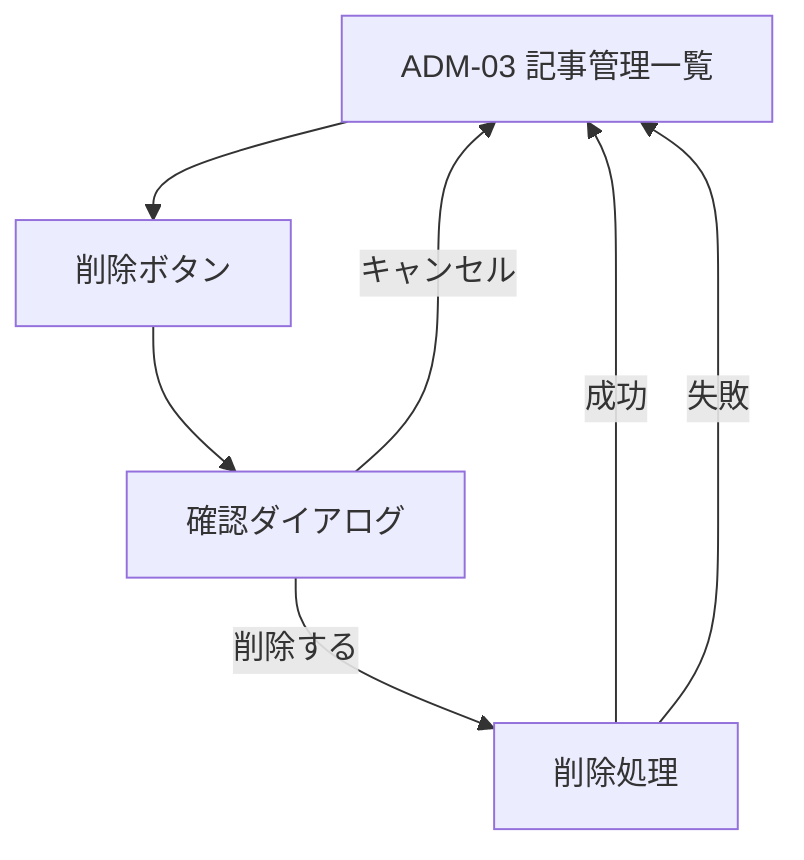

# 画面遷移

## 前提

- 正本は `docs/requirements.md` とする。
- 今回は設計資料のみを作成し、Rails の routes、Controller、View は実装しない。
- 一般利用者はログインせず、公開済み記事のみ閲覧できる。
- 管理者はログイン後、記事の投稿・編集・削除を行う。
- 未認証で管理画面URLへ直接アクセスした場合は、ログイン画面へ転送する。
- ログイン成功後は常に `/admin` へ遷移する。アクセス元URLを保存する `return_to` は実装しない。
- 404エラーページは画面設計上 `PUB-04` として維持するが、`/404` を通常利用する独立ルートとして必須にはしない。
- 一般画面には投稿日を表示しない。

## 画面ID一覧

| 画面ID | 画面名 | 想定URL |
| --- | --- | --- |
| PUB-01 | トップページ | `/` |
| PUB-02 | 記事一覧ページ | `/articles` |
| PUB-03 | 記事詳細ページ | `/articles/:id` |
| PUB-04 | 404エラーページ | HTTP 404 |
| ADM-01 | 管理者ログインページ | `/admin/login` |
| ADM-02 | 管理画面トップ | `/admin` |
| ADM-03 | 記事管理一覧ページ | `/admin/articles` |
| ADM-04 | 記事新規作成ページ | `/admin/articles/new` |
| ADM-05 | 記事編集ページ | `/admin/articles/:id/edit` |

## 一般利用者フロー

Mermaidが表示されない場合の説明:

1. 一般利用者はトップページ `/` にアクセスする。
2. トップページから記事一覧 `/articles` またはおすすめ記事の詳細 `/articles/:id` へ移動する。
3. 記事一覧から記事詳細へ移動する。
4. 記事詳細から関連記事、記事一覧、記事内リンクへ移動できる。
5. 存在しない記事、非公開記事、削除済み記事にアクセスした場合は404エラーページを表示する。

## 管理者フロー

Mermaidが表示されない場合の説明:

1. 管理者は `/admin/login` でログインする。
2. ログイン成功後は `/admin` に移動する。
3. 管理画面トップから `/admin/articles` に移動する。
4. 記事管理一覧から新規作成 `/admin/articles/new` に移動し、保存成功後は記事管理一覧へ戻る。
5. 記事管理一覧から編集 `/admin/articles/:id/edit` に移動し、更新成功後は記事管理一覧へ戻る。
6. 削除は記事管理一覧で確認後に実行する。
7. ログアウト後はログイン画面へ戻る。

## 未認証時フロー

Mermaidが表示されない場合の説明:

- 未ログイン状態で `/admin`、`/admin/articles`、`/admin/articles/new`、`/admin/articles/:id/edit` にアクセスした場合は `/admin/login` へ転送する。
- ログイン成功後は常に `/admin` へ移動する。
- アクセスしようとしたURLの保存や復帰は実装しない。
- 課題要件上は未認証アクセス防止が優先であり、遷移先固定によりMVPの実装範囲を抑える。

## エラー時フロー

### 存在しない記事

- 一般利用者が存在しない `/articles/:id` にアクセスする。
- 公開済み記事が見つからない場合は `PUB-04 404エラーページ` を表示する。
- 非公開記事は一般利用者に存在を知らせないため、404扱いにする。

### 入力エラー

- 管理者が記事新規作成または編集で不正な値を送信する。
- 保存・更新せず、同じ画面にエラーを表示する。
- 入力済みのタイトル、本文、タグ、公開状態は可能な限り保持する。
- 例:
  - タイトル未入力
  - 本文未入力
  - 本文400文字未満。Action Text本文のHTMLタグを除いたplain textで判定する。
  - タグ形式不正
  - 画像形式不正
  - 画像容量超過

### ログイン失敗

- 管理者が誤ったメールアドレスまたはパスワードを入力する。
- `/admin/login` に留まり、「ログイン情報が正しくありません」のようなメッセージを表示する。
- セキュリティ上、メールアドレスが存在するかどうかを分けて表示しない。

### 削除失敗

- 記事削除時にDBエラーや関連データ処理の失敗が発生した場合、記事管理一覧へ戻りエラーを表示する。
- Active Storage添付ファイルやAction Text本文に関連データがあるため、実装時は関連削除の挙動を確認する。

## 削除フロー

補足:

- MVPでは物理削除を推奨する。
- 誤操作防止のため、削除前に確認ダイアログを表示する。
- 削除後の記事詳細URLは404扱いにする。

## ルーティング方針

Rails実装時は以下のURL構成を推奨する。

| 用途 | HTTPメソッド | URL | 備考 |
| --- | --- | --- | --- |
| トップ | GET | `/` | `home#index` など |
| 一般記事一覧 | GET | `/articles` | 公開記事のみ |
| 一般記事詳細 | GET | `/articles/:id` | 公開記事のみ |
| 管理者ログインフォーム | GET | `/admin/login` | 認証不要 |
| 管理者ログイン実行 | POST | `/admin/login` | 認証不要 |
| 管理者ログアウト | DELETE | `/admin/logout` | 認証必要 |
| 管理画面トップ | GET | `/admin` | 認証必要 |
| 管理記事一覧 | GET | `/admin/articles` | 認証必要 |
| 管理記事新規作成 | GET | `/admin/articles/new` | 認証必要 |
| 管理記事作成 | POST | `/admin/articles` | 認証必要 |
| 管理記事編集 | GET | `/admin/articles/:id/edit` | 認証必要 |
| 管理記事更新 | PATCH/PUT | `/admin/articles/:id` | 認証必要 |
| 管理記事削除 | DELETE | `/admin/articles/:id` | 認証必要 |

## 設計上の検討事項と推奨

| 検討事項 | 推奨案 | 理由 |
| --- | --- | --- |
| 管理者は1名固定か複数登録可能か | DB上は複数登録可能、運用は1名 | 権限分けは対象外だが、Railsでは複数行を許容した方が自然 |
| 管理者の新規登録画面を作るか | 作らない | 4週間MVPでは不要。登録画面はセキュリティ検討が増える |
| 初期管理者をseedsで作成するか | 作成する | 管理者ログイン情報提出要件に対応しやすい |
| ログインIDをメールアドレスにするか | メールアドレスで確定 | 一意制約を設定しやすく、管理者IDログインは実装しない |
| 記事公開状態を持つか | 持つ | 下書き作成後に公開でき、一般画面に未完成記事を出さずに済む |
| 下書き保存を実装するか | 公開状態で実現する | 専用ワークフローは作らず、`draft` / `published` 程度に絞る |
| 記事概要を手入力にするか本文から生成するか | 手入力を推奨 | 一覧で読みやすい文章を管理者が調整できる |
| 一覧用画像と本文画像を分けるか | 分ける | 一覧用thumbnailは記事カード用、本文画像はAction Text用に役割が違う |
| タグ入力をカンマ区切りUIにする方法 | 1つのテキスト入力欄 | 要件に合い、実装工数が低い |
| 記事削除時の確認 | 必須 | 誤削除防止 |
| 削除方式 | 物理削除 | 論理削除は工数と条件分岐が増えるためMVPでは過剰 |
| 404ページの実装時期 | Week 4 | 初期設計には含め、仕上げで実装する。独立ルート `/404` は必須にしない |
