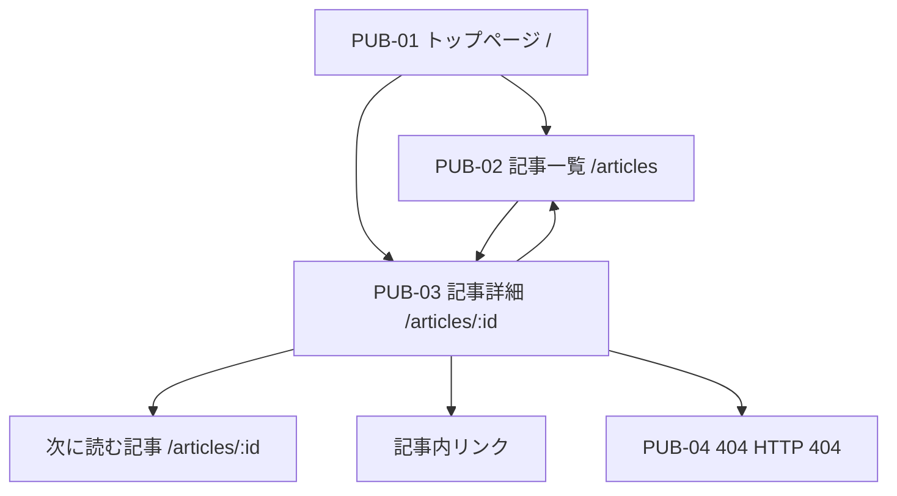
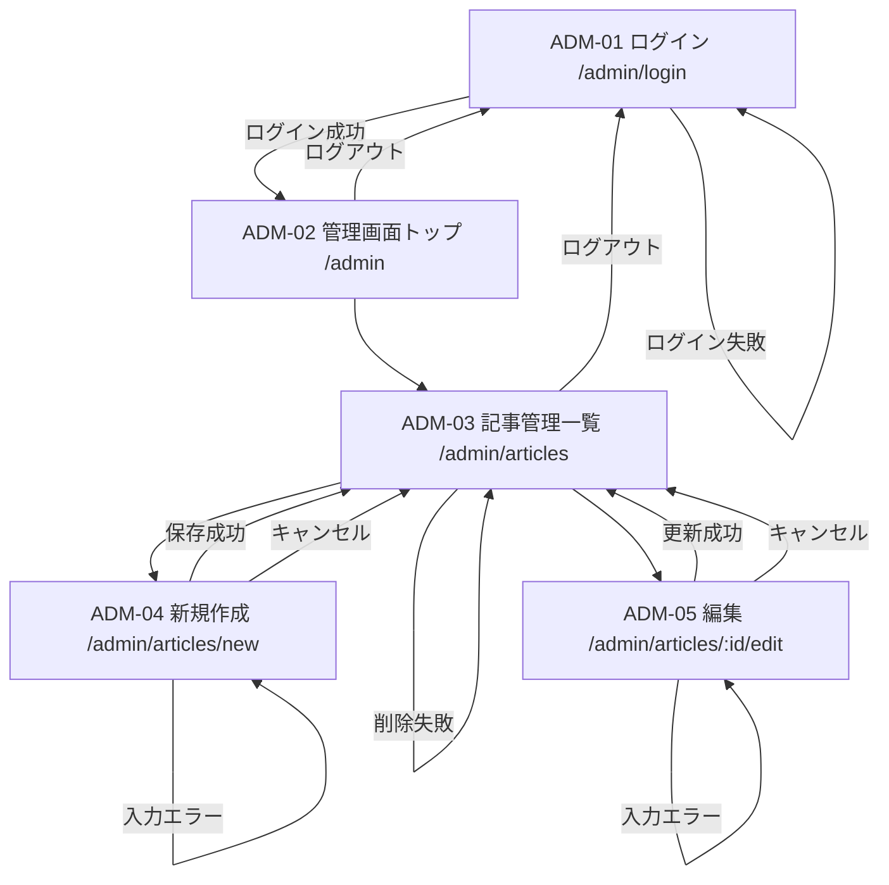
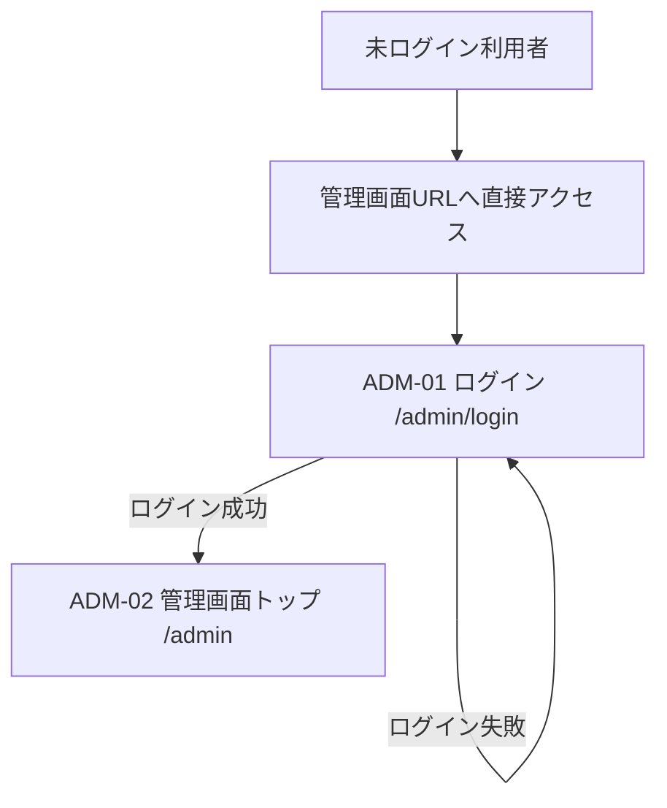
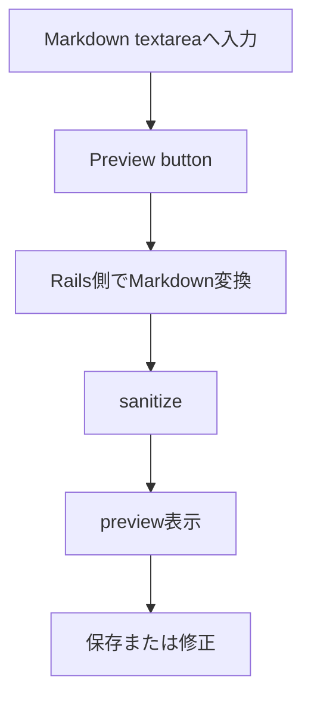
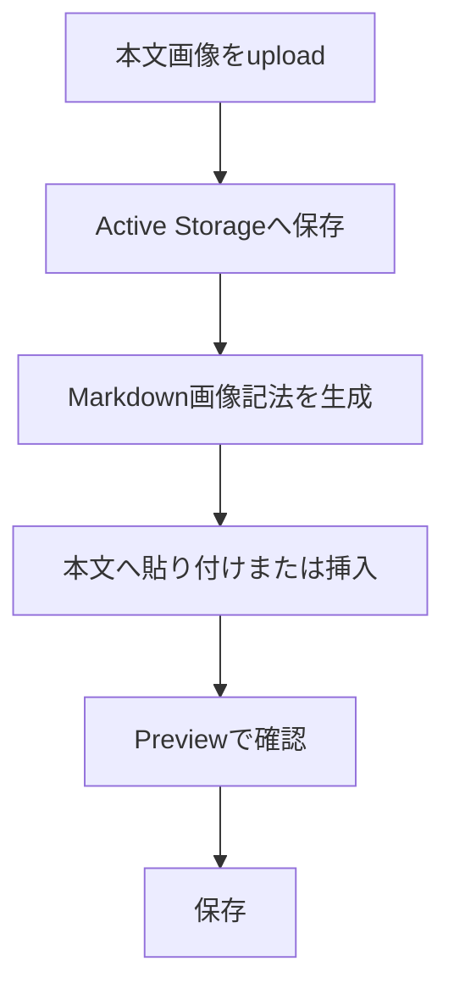

# 画面遷移

## 前提

- 正本は `docs/requirements.md` とする。
- Ruby on Rails + Markdownで実装する設計とし、Action TextとTrixは採用しない。
- 一般利用者はログインせず、`published` の記事のみ閲覧できる。
- 管理者はログイン後、Markdown記事の投稿・編集・削除を行う。
- 未認証で管理画面URLへ直接アクセスした場合は、ログイン画面へ転送する。
- ログイン成功後は常に `/admin` へ遷移する。`return_to` は実装しない。
- 一般画面には投稿日を表示しない。
- 404エラーページは画面設計上 `PUB-04` として維持するが、`/404` を通常利用する独立ルートとして必須にはしない。

## 画面ID一覧

| 画面ID | 画面名 | 想定URL |
| --- | --- | --- |
| PUB-01 | トップページ | `/` |
| PUB-02 | 記事一覧ページ | `/articles` |
| PUB-03 | 記事詳細ページ | `/articles/:id` |
| PUB-04 | 404エラーページ | HTTP 404 |
| ADM-01 | 管理者ログインページ | `/admin/login` |
| ADM-02 | 管理画面トップ | `/admin` |
| ADM-03 | 記事管理一覧ページ | `/admin/articles` |
| ADM-04 | 記事新規作成ページ | `/admin/articles/new` |
| ADM-05 | 記事編集ページ | `/admin/articles/:id/edit` |

## 一般利用者フロー

Mermaidが表示されない場合の説明:

1. 一般利用者はトップページ `/` にアクセスする。
2. トップページから記事一覧 `/articles` またはおすすめ記事の詳細 `/articles/:id` へ移動する。
3. 記事一覧から記事詳細へ移動する。
4. 記事詳細では、見出し、表、引用、inline code、fenced code block、実行結果例、画像、タグ、まとめ、次に読む記事を閲覧する。
5. 存在しない記事、非公開記事、削除済み記事にアクセスした場合はHTTP 404でエラーページを表示する。

## 管理者フロー

Mermaidが表示されない場合の説明:

1. 管理者は `/admin/login` でメールアドレスとパスワードを入力する。
2. ログイン成功後は常に `/admin` に移動する。
3. 管理画面トップから `/admin/articles` に移動する。
4. 記事管理一覧から新規作成 `/admin/articles/new` に移動する。
5. 新規作成・編集画面ではMarkdown本文textareaへ入力し、Preview buttonでRails側のMarkdown変換・sanitize結果を確認する。
6. 本文画像はupload補助でMarkdown画像記法を生成し、本文へ貼り付けまたは挿入する。
7. 保存・更新成功後は記事管理一覧へ戻る。
8. 削除は記事管理一覧で確認後に実行する。
9. ログアウト後はログイン画面へ戻る。

## 未認証時フロー

説明:

- 未ログイン状態で `/admin`、`/admin/articles`、`/admin/articles/new`、`/admin/articles/:id/edit` にアクセスした場合は `/admin/login` へ転送する。
- ログイン成功後は常に `/admin` へ移動する。
- アクセスしようとしたURLの保存や復帰は実装しない。

## Markdown入力・Previewフロー

説明:

- PreviewはRails側のMarkdown変換処理を共通利用するbutton式を推奨する。Backendは `POST /admin/markdown_preview` でMarkdown本文を受け取り、保存せずJSONでsanitize済みHTMLを返す。
- real-time previewは80時間MVPでは簡略化可能とする。
- JavaScriptを使う場合も補助的なUIに限定し、Markdown変換の正本処理はRails側に置く。

## 本文画像フロー

説明:

- 80時間MVPでは「画像upload後、生成されたMarkdown記法をcopyして本文へ貼り付ける方式」を最も安全な推奨案とする。
- 自動挿入は便利だがJavaScriptとUI調整が増えるため、時間不足時はcopy方式を優先する。
- 記事削除時はthumbnailと本文画像の扱いを確認する。本文から参照されなくなった画像の自動削除はMVPでは必須にしない。

## エラー時フロー

### 存在しない記事・非公開記事

- 一般利用者が存在しない `/articles/:id` にアクセスする。
- 公開済み記事が見つからない場合は `PUB-04 404エラーページ` をHTTP 404で表示する。
- 非公開記事は一般利用者に存在を知らせないため、404扱いにする。

### 入力エラー

- 管理者が記事新規作成または編集で不正な値を送信する。
- 保存・更新せず、同じ画面にエラーを表示する。
- 入力済みのタイトル、概要、Markdown本文、タグ、公開状態は可能な限り保持する。
- 例:
  - タイトル未入力
  - 概要未入力
  - 本文未入力
  - 本文400文字未満。Markdown記号やHTMLではなく表示上のplain text相当で判定する。
  - Markdown変換エラー
  - sanitize後previewの表示エラー
  - タグ形式不正
  - 画像形式不正
  - 画像容量超過

### ログイン失敗

- 管理者が誤ったメールアドレスまたはパスワードを入力する。
- `/admin/login` に留まり、「ログイン情報が正しくありません」のようなメッセージを表示する。
- セキュリティ上、メールアドレスが存在するかどうかを分けて表示しない。

### 削除失敗

- 記事削除時にDBエラーや関連データ処理の失敗が発生した場合、記事管理一覧へ戻りエラーを表示する。
- Active Storage添付ファイルがあるため、削除時の関連データの扱いを実装時に確認する。

## ルーティング方針

Rails実装時は以下のURL構成を推奨する。

| 用途 | HTTPメソッド | URL | 備考 |
| --- | --- | --- | --- |
| トップ | GET | `/` | 公開記事一覧・詳細Backend実装時点では `articles#index`。トップ専用画面は後続Task |
| 一般記事一覧 | GET | `/articles` | `published` のみ |
| 一般記事詳細 | GET | `/articles/:id` | `published` のみ |
| 管理者ログインフォーム | GET | `/admin/login` | 認証不要 |
| 管理者ログイン実行 | POST | `/admin/login` | 認証不要 |
| 管理者ログアウト | DELETE | `/admin/logout` | 認証必要 |
| 管理画面トップ | GET | `/admin` | 認証必要 |
| 管理記事一覧 | GET | `/admin/articles` | 認証必要 |
| 管理記事新規作成 | GET | `/admin/articles/new` | 認証必要 |
| 管理記事作成 | POST | `/admin/articles` | 認証必要 |
| 管理記事編集 | GET | `/admin/articles/:id/edit` | 認証必要 |
| 管理記事更新 | PATCH/PUT | `/admin/articles/:id` | 認証必要 |
| 管理記事削除 | DELETE | `/admin/articles/:id` | 認証必要 |
| Markdown preview | POST | `/admin/markdown_preview` | 認証必要。保存せず `{ html: "..." }` JSONでsanitize済みHTMLを返す |
| 本文画像upload補助 | POST | `/admin/article_images` など | 認証必要。実装時に最終決定 |

## 設計上の検討事項と推奨

| 検討事項 | 推奨案 | 理由 |
| --- | --- | --- |
| Markdown preview | button式でRails側へ送信 | 変換・sanitize処理を共通化でき、Ruby中心で実装できる |
| real-time preview | 簡略化可能 | Frontend実装が増えるため80時間MVPでは必須にしない |
| 本文画像方式 | upload後にMarkdown記法をcopyして貼り付け | 実装時間とSecurityのバランスがよい |
| 簡易目次 | 候補。必須ではない | 時間不足時は手動リンクまたは目次なしへ縮小 |
| syntax highlighting | 候補。必須ではない | 高度な見た目より本文表示とcode block表示を優先 |
| 管理者登録画面 | 作らない | 初期管理者は `db/seeds.rb` |
| ログインID | メールアドレス | 管理者IDログインは実装しない |
| 記事公開状態 | `draft` / `published` | 一般画面に未完成記事を出さない |
| 削除方式 | 物理削除 | 論理削除はMVPでは過剰 |
